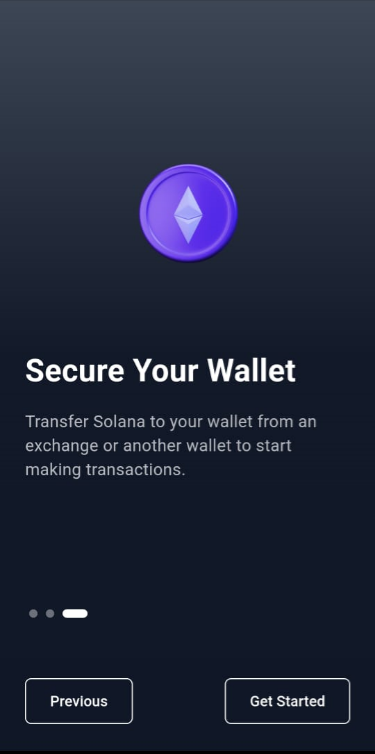
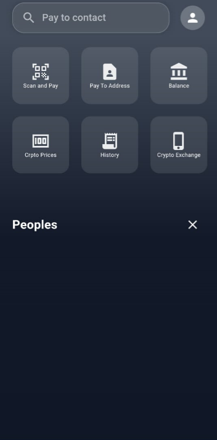

# BlazePay
A Solana based payments app with the simplicity of Gpay.

# BlazePay (bpay)

BlazePay (bpay) is a high-performance blockchain-based payment system built on the Solana blockchain. It is designed to provide fast, secure, and scalable payment processing, similar to Google Pay, with the added benefits of decentralization, enhanced security, and reduced transaction fees. BlazePay allows users to make transactions by simply scanning QR codes, leveraging the power of blockchain to ensure immutability and transparency.




## Features
- **Fast Transactions**: Built on the Solana blockchain, BlazePay ensures high throughput and low latency for payment processing.
- **Secure Payments**: Transactions are secured with blockchain technology, reducing the risk of fraud and unauthorized access.
- **QR Code Payments**: Users can send and receive payments simply by scanning QR codes, providing a seamless and easy-to-use experience.
- **Low Transaction Fees**: BlazePay benefits from the low fees associated with the Solana blockchain, making it an affordable solution for users.


## Installation

### Prerequisites
Before you begin, ensure you have the following installed on your system:
- **Solana CLI**: For interacting with the Solana blockchain.
- **Rust**: Required for compiling the on-chain program.
- **Node.js & npm**: Required for the front-end application.

### Steps to Install
1. Clone the repository:
    ```bash
    git clone https://github.com/yourusername/blazepay.git
    cd blazepay
    ```

2. Install the dependencies:
    ```bash
    npm install
    ```

3. Set up your Solana wallet and configure your environment:
    ```bash
    solana-keygen new --outfile ~/blazepay-wallet.json
    solana config set --keypair ~/blazepay-wallet.json
    ```

4. Run the application:
    ```bash
    npm start
    ```

## Usage

1. Launch the application on your local machine or deploy it to a server.
2. Use your wallet to send and receive payments.
3. Scan QR codes to quickly initiate transactions.

### QR Code Example
Below is an example of a payment interface where users can scan a QR code to receive payments.


### User Dashboard
The user dashboard allows users to monitor their transaction history, balances, and send/receive funds directly from the app.




## Acknowledgements
- **Solana**: For providing a high-performance blockchain platform.
- **React**: For the front-end framework.
- **Metamask**: For integration with wallet services.